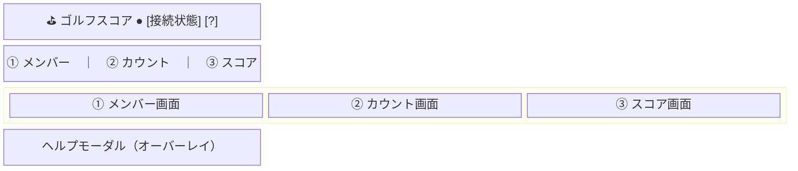
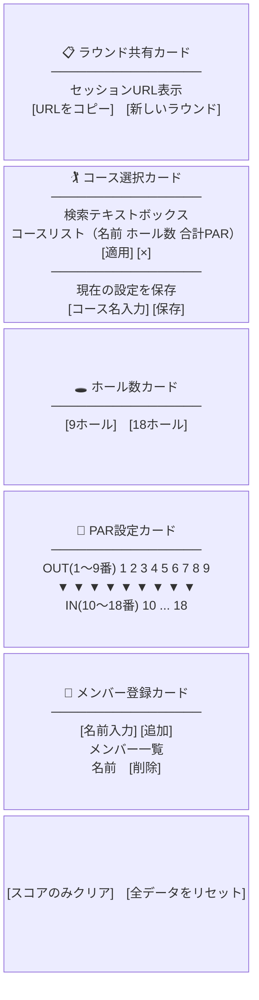
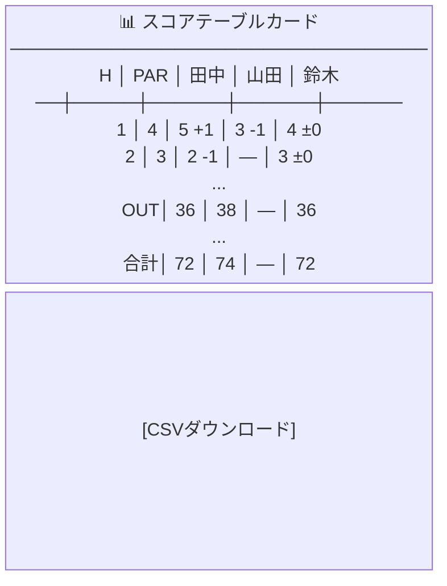
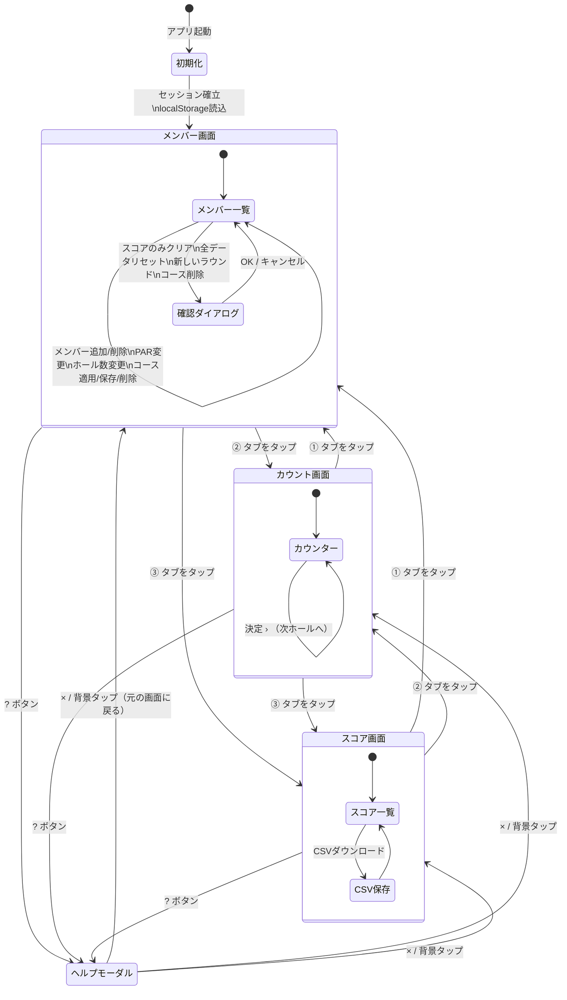
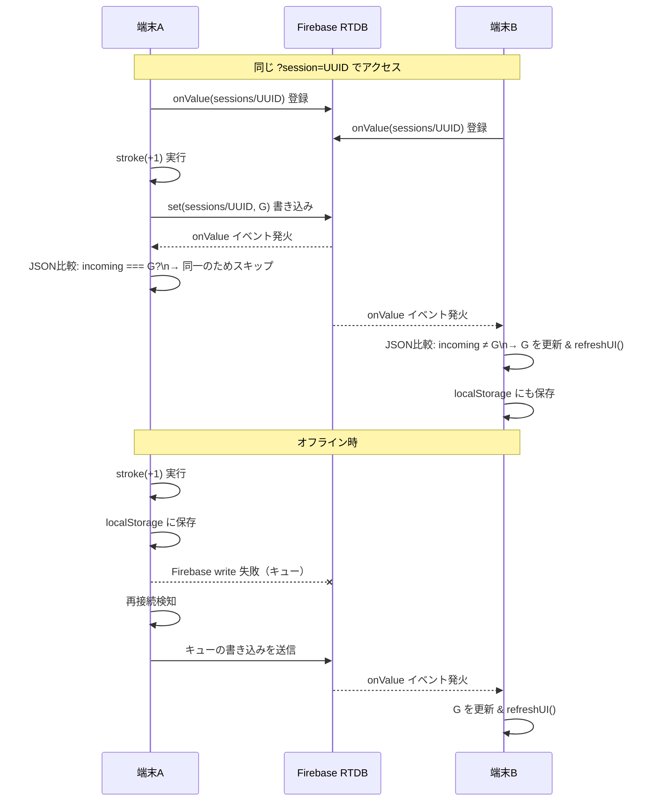
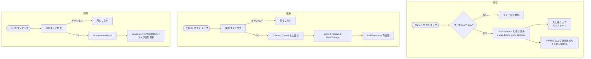
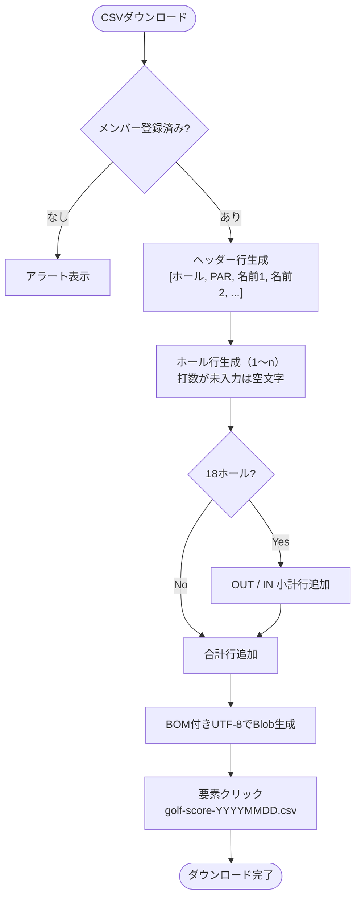
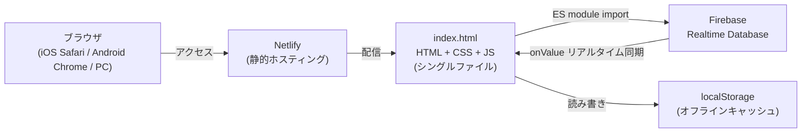

# ゴルフスコア アプリ — 設計ドキュメント

---

## 1. 要件定義

### 1-1. プロジェクト概要

| 項目 | 内容 |
|---|---|
| アプリ名 | ゴルフスコア |
| 形態 | シングルHTMLファイル（ビルド不要） |
| 対象 | スマートフォン優先、PCブラウザでも動作 |
| ホスティング | Netlify（静的ファイル配信） |
| リアルタイムDB | Firebase Realtime Database |

---

### 1-2. 機能要件

#### FR-01 セッション管理
- アプリ起動時に UUID v4 のセッションIDを自動生成し、URLパラメータ `?session=<UUID>` として付与する
- 既存セッションIDはURLパラメータ → localStorage の順に優先して読み込む
- 「URLをコピー」ボタンで現在のセッションURLをクリップボードにコピーできる
- 「新しいラウンド」ボタンで新セッションを生成し、過去データは元URLから引き続き参照できる

#### FR-02 コース管理
- コース名・ホール数・各ホールPARをFirebase共有DB（`courses/`）に保存できる
- コース名の部分一致検索で保存済みコースを絞り込み表示できる（最大8件）
- 「適用」ボタンでコースデータを現在のセッションに反映できる
- 「×」ボタンで保存済みコースを削除できる
- コースデータは全ユーザーで共有される

#### FR-03 ホール数・PAR設定
- 9ホール / 18ホールを選択できる
- 各ホールのPARを個別に設定できる（PAR 3〜5）
- 18ホール時はOUT（1〜9番）/ IN（10〜18番）に分けて表示する
- 設定変更は即時Firebase & localStorageに保存される

#### FR-04 メンバー管理
- メンバー名（最大10文字）を登録できる
- メンバーを削除するとそのメンバーのスコアも連動して削除される
- メンバーIDはUnixタイムスタンプ（`Date.now()`）で生成する

#### FR-05 スコア入力（カウンター）
- 対象メンバー・対象ホールをタブ/丸ボタンで選択できる
- 「＋」「−」ボタンで打数を増減できる（最小0 = 未入力扱い）
- 数字部分タップでキーボード直接入力モードに切り替えられる（0〜20の範囲）
- カウンターの初期表示値はそのホールのPAR
- 「＋」「−」ボタン操作時点で即座に保存される
- 「決定 ›」ボタンで次のホールへ移動（未入力の場合はPARとして記録）
- 入力済みホールは丸ボタンに緑ドットが表示される

#### FR-06 スコア表示
- ホール×メンバーの打数とPAR差（+/−）を一覧表示する
- 18ホール時はOUT/IN小計行を表示する
- 合計行はスコア合計とPAR差を表示する
- スコアランク（Eagle以上 / Birdie / Par / Bogey / Double Bogey / +3以上）を色で区別する

#### FR-07 スコアラベル表示
| 打数 / PAR差 | ラベル |
|---|---|
| 1打でホールイン | Hole-in-one! |
| PAR比 −4以下 | Condor |
| PAR比 −3 | Albatross |
| PAR比 −2 | Eagle |
| PAR比 −1 | Birdie |
| PAR比 ±0 | Par |
| PAR比 +1 | Bogey |
| PAR比 +2 | Double Bogey |
| PAR比 +3以上 | （表示なし） |

#### FR-08 データ管理
- 「スコアのみクリア」：スコアデータのみ削除、メンバー・PAR設定は保持
- 「全データをリセット」：メンバー・スコア・設定をすべて削除

#### FR-09 CSV出力
- スコア表をCSV形式でダウンロードできる
- ファイル名：`golf-score-YYYYMMDD.csv`
- UTF-8 BOM付き（日本語Excel対応）
- ホール別スコア・OUT/IN小計（18H時）・合計を含む

#### FR-10 リアルタイム同期
- 同じセッションURLを開いた複数端末間でデータをリアルタイムに同期する
- Firebase `onValue` でデータ変更を監視し、自端末の書き込みエコーはスキップする

#### FR-11 オフライン対応
- Firebase接続が切れていてもlocalStorageに保存し、入力を継続できる
- 再接続時にFirebaseへ自動同期される
- ヘッダーの接続ドット（●）でオンライン/オフライン状態を視覚的に確認できる

---

### 1-3. 非機能要件

| 分類 | 要件 |
|---|---|
| 対応端末 | スマートフォン（iOS/Android）・PCブラウザ |
| 最大幅 | 480px（中央寄せ） |
| ダブルタップズーム | 無効（`touch-action: manipulation`） |
| セキュリティ | Firebase Security Rules により `sessions/$sessionId` と `courses` のみ読み書き許可 |
| セッション推測困難性 | UUID128ビットにより総当たり攻撃を実質不可能にする |
| インストール | 不要（ブラウザで直接動作） |

---

## 2. 画面設計

### 2-1. 画面一覧



---

### 2-2. ① メンバー画面 レイアウト



---

### 2-3. ② カウント画面 レイアウト

```mermaid
block-byzantine
  columns 1
  A["👥 メンバー選択カード\n─────────────────\n[田中] [山田] [鈴木] ...  （横スクロール）"]
  B["🕳️ ホール選択カード\n─────────────────\n●1 ●2 ●3 ... ●9  （横スクロール・入力済みは緑ドット）"]
  C["🎯 カウンターカード\n─────────────────\n　田中　3番ホール\n─────────────────\n[−]　　　5　　　[＋]\n　　　　PAR 4\n　　　　Birdie\n─────────────────\n[　　決定　›　　]"]
```

---

### 2-4. ③ スコア画面 レイアウト



---

## 3. 画面遷移図



---

## 4. 処理フロー

### 4-1. アプリ初期化フロー

```mermaid
flowchart TD
    Start([アプリ起動]) --> LS[localStorageからG読込]
    LS --> P1{URLパラメータに\nsession=?}
    P1 -->|あり| UseURL[URLのsessionIdを使用]
    P1 -->|なし| P2{localStorageに\ngolf_sid?}
    P2 -->|あり| UseLS[localStorageのsessionIdを使用]
    P2 -->|なし| NewID[crypto.randomUUID()で生成]
    UseURL --> UpdateURL[URL & localStorageを更新]
    UseLS  --> UpdateURL
    NewID  --> UpdateURL
    UpdateURL --> ShowURL[セッションURL表示]
    ShowURL --> StartSync[Firebase onValueリスナー登録]
    StartSync --> LoadCourses[コースDB読込]
    LoadCourses --> BuildUI[UI構築\nbuildParInputs / buildMemberList]
    BuildUI --> End([準備完了])
```

---

### 4-2. スコア入力フロー（カウンター）

```mermaid
flowchart TD
    Start([カウント画面を開く]) --> HasMember{メンバー登録済み?}
    HasMember -->|なし| ShowMsg[案内メッセージ表示]
    HasMember -->|あり| SelectMember[メンバー選択\nctrMid = 選択ID]
    SelectMember --> SelectHole[ホール選択\nctrHole = 選択番号]
    SelectHole --> ShowCounter[カウンター表示\n初期値 = pars&#91;ctrHole&#93;]

    ShowCounter --> PlusMinus{＋/−ボタン操作}
    PlusMinus --> Calc[打数 = 現在値 ± 1\n最小0 = 未入力扱い]
    Calc --> Save1[Firebase & localStorage保存]
    Save1 --> Dot[ホールドットを緑に更新]
    Dot --> ShowDiff[スコアラベル表示]
    ShowDiff --> PlusMinus

    ShowCounter --> TapNum{数字タップ}
    TapNum --> EditMode[直接入力モード\nキーボード表示]
    EditMode --> Blur[フォーカスアウト / Enter]
    Blur --> ClampVal[値クランプ 0〜20]
    ClampVal --> Save2[Firebase & localStorage保存]
    Save2 --> ShowDiff

    ShowDiff --> Confirm{決定 › タップ}
    Confirm --> Recorded{スコア記録済み?}
    Recorded -->|なし| SetPar[PAR値を記録]
    Recorded -->|あり| NextHole{最終ホール?}
    SetPar --> NextHole
    NextHole -->|No| MoveNext[ctrHole++]
    NextHole -->|Yes| Stay[現在ホールに留まる]
    MoveNext --> SelectHole
    Stay --> ShowCounter
```



---

### 4-3. Firebase リアルタイム同期フロー



---

### 4-4. コース保存・適用フロー



---

### 4-5. CSV出力フロー



---

### 4-6. データ状態管理

```mermaid
stateDiagram-v2
    direction LR
    [*] --> 未保存 : アプリ初期状態

    state "セッションデータ (G)" as G {
        未保存 --> 保存済み : save() 呼び出し
        保存済み --> 保存済み : save() 呼び出し（更新）
        保存済み --> リセット済み : resetAll() / clearScores()
        リセット済み --> 保存済み : save() 呼び出し
    }

    state "保存先" as Dest {
        Firebase : sessions/&#123;sessionId&#125;
        LS : localStorage\ngolfApp_v1
    }

    保存済み --> Firebase : set() 非同期
    保存済み --> LS : setItem() 同期
```



---

## 5. データ構造

### 5-1. セッションデータ（Firebase `sessions/{sessionId}` & localStorage `golfApp_v1`）

```json
{
  "holes": 9,
  "pars": [4, 3, 4, 5, 4, 4, 3, 4, 5],
  "members": [
    { "id": 1715000000000, "name": "田中" },
    { "id": 1715000000001, "name": "山田" }
  ],
  "scores": {
    "1715000000000_0": 5,
    "1715000000000_1": 3,
    "1715000000001_0": 4
  }
}
```

> キー形式：`{memberId}_{holeIndex}`（0始まり）

---

### 5-2. コースデータ（Firebase `courses/{pushId}`）

```json
{
  "name": "○○カントリークラブ",
  "holes": 18,
  "pars": [4, 3, 5, 4, 4, 3, 4, 5, 4, 4, 3, 4, 5, 4, 4, 3, 4, 5],
  "savedAt": 1715000000000
}
```

---

## 6. Firebase セキュリティルール

```json
{
  "rules": {
    "sessions": {
      "$sessionId": {
        ".read": true,
        ".write": true
      }
    },
    "courses": {
      ".read": true,
      ".write": true
    },
    "$other": {
      ".read": false,
      ".write": false
    }
  }
}
```

---

## 7. 技術スタック


